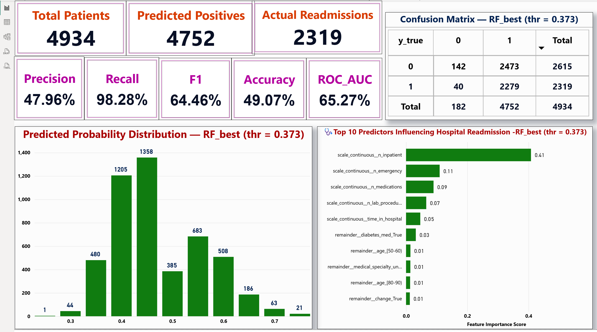

# hospital-readmission-capstone
Recall-first ML project predicting 30-day hospital readmissions. Includes EDA &amp; model notebooks (Logistic Regression &amp; Random Forest with threshold tuning), a Power BI dashboard, and reproducibility notes. Raw data excluded; see /data/README.md for access instructions.

# Hospital Readmission Prediction (Capstone)

Predicting 30-day hospital readmissions from structured EHR-like tabular data.  
Focus: **high recall** to catch as many potential readmissions as possible, with model transparency and an Ops-friendly Power BI view.

---

## 🧭 Project Summary
- Built a recall-first ML pipeline (EDA → feature engineering → model training/validation).
- Compared baseline Logistic Regression vs. Random Forest and tuned threshold to prioritize **Recall ≈ 0.98** at **thr ≈ 0.373**  
  (trade-offs: **F1 ≈ 0.64**, **Accuracy ≈ 0.49**, **ROC-AUC ≈ 0.65**).
- Delivered a one-page **Power BI** dashboard for non-technical stakeholders (confusion matrix, KPIs, feature importance).

---

## 📁 Repository Structure

Hospital_Readmission_Capstone/
├─ data/ # (Empty here) put instructions-only README inside
├─ exports/ # (Optional) place any saved artifacts here
├─ notebooks/
│ ├─ 00_capstone_eda.ipynb # EDA, cleaning, class imbalance checks
│ └─ 01_capstone_models.ipynb # Modeling, metrics, thresholding, feature importance
└─ reports/
├─ Capstone_HospReadmin_Final_MyoMyintAungJimmy.pptx
├─ CapstoneProject_HospitalReadmission_WordReport_MyoMyintAungJimmy.docx
├─ CapstoneProject_HospitalReadmission_PowerBIDashboard_MyoMyintAungJimmy.pbix
└─ PowerBI_dashboard.png

> **Note:** This repo does **not** include raw data. See **Data** section below for how to get it.

---

## 🧪 Data
- Source: Kaggle – *Hospital Readmissions* dataset.  
  Kaggle page: **(add link here)**  
- To reproduce:
  1. Download the dataset locally.
  2. Place raw CSV/XLSX files under `notebooks/data/` (keep file names used in the notebooks).
- This public repo excludes raw data to keep the repository light and respect data distribution terms.

---

## 🛠️ Tech & Tools
- **Python**: pandas, numpy, matplotlib, scikit-learn  
- **Power BI**: single-page ops dashboard (.pbix)  
- **Environment**: Jupyter Notebooks (no re-run required to read; code and outputs are preserved)

---

## 🔍 Modeling Approach (short)
- Baselines: Dummy & Logistic Regression  
- Tree-based: Random Forest (feature importance for explainability)  
- Class imbalance handled via threshold tuning to favor **Recall**.  
- Key features (top importance): *n_inpatient, n_emergency, n_medications, n_lab_procedures, time_in_hospital*, etc.

---

## 📊 Power BI
- `reports/CapstoneProject_HospitalReadmission_PowerBIDashboard_MyoMyintAungJimmy.pbix`  
  - KPIs: Total Patients, Predicted Positives, Actual Readmissions, Precision, Recall, F1, Accuracy, ROC-AUC  
  - Confusion Matrix at tuned threshold  
  - Probability distribution & top features

---

## 🚀 Quick Start
1. Clone or download this repo.  
2. Open `reports/Capstone_HospReadmin_Final_MyoMyintAungJimmy.pptx` for a concise presentation.  
3. Open notebooks in `notebooks/` to review full workflow (reading only; re-run optional).  
4. (Optional) Open the Power BI `.pbix` to explore dashboard interactively.

---

## ⚖️ Notes & Ethics
- Models are for demonstration only; not approved for clinical use.  
- Thresholds optimize recall and may increase false positives—must be evaluated with clinical stakeholders.  

---

## 📄 License
This repository is released under the **MIT License** (see `LICENSE`).

